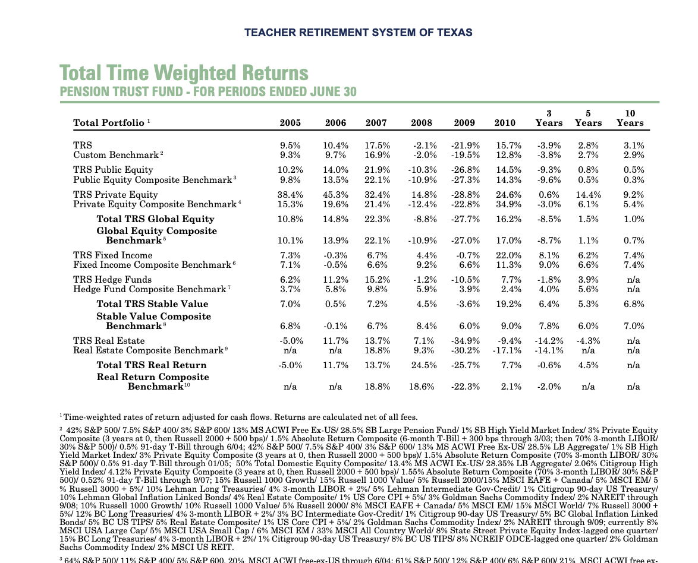
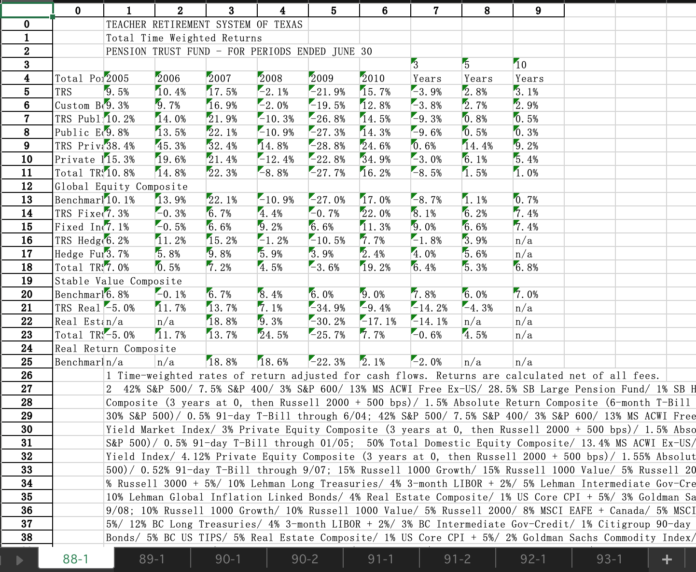
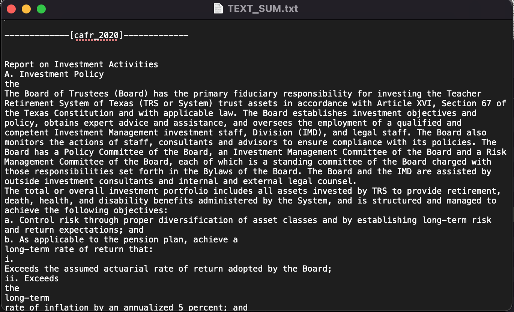
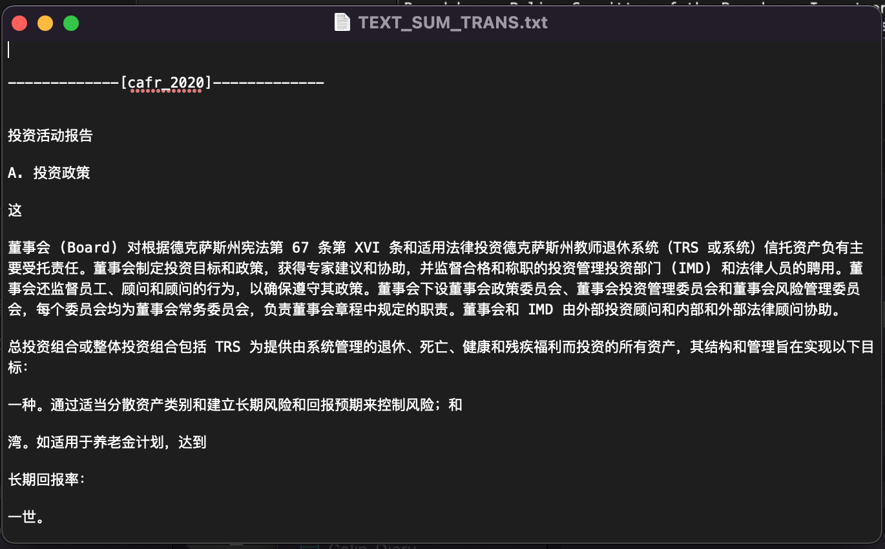

# Text-Extract
一个绝妙的文本挖掘小工具！从PDF批量提取精确的表格和文字，即使是**分栏的文字**和**没有边界的表格也能**轻松面对！

## 背景
投资学作业要求研究FSA 2010-2021年间的投资策略,因此需要从原始年报PDF汇总10年间的所有数据.

## 问题

Colin并没有在网络上找到汇总了10年间数据的相关图表,因此要在原始年报PDF中提取然后制作,哭哭...

Colin没有耐心打开10份PDF复制粘贴里面的表格,然后还要挨个在Excel里面调整格式...

一想到以后的学习和研究中还会有很多这样的需求,于是Colin试了许多的工具包的组合,踩了许多坑,最终形成了面这样一个好用的方法~嘻嘻

## 解决方案

1. PDF表格提取 - Camelot

   使用Camelot来处理,Camelot适合提取表格,但是**一定要调参**,默认只能识别带有边框的表格 (==非常重要!!!==)

   

2. PDF文字提取 - pdfminer-six
   PDF文字布局可能是**一栏或者多栏**,而pdfminer-six擅长Layout的处理
   注意没有使用pdfminer 3K或者pdfminer,名字的细微差别将会导致引用错误 (==非常重要!!!==)

3. PDF文字翻译 - pygtrans
   随便网上找的一个,pygtrans使用的是Google Translate,虽然有点生硬,但是适合快速把握文字大意~

   

4. PDF目录提取 - 手动
   对于固定目录可以正则提取章节对应的页码,但是10份PDF的目录可能都在不同的页面,因此这里只能手动输入想要的章节的页码了...
   PDF是多么的混乱和糟糕!,完全自动处理很难work,手动+自动相结合可以很棒棒~

## 最终结果
1. 输入
   - 10份英文PDF

   
   
2. 输出
   - 10份Excel:
     - 每份Excel里面包含了每份PDF目标章节中所有表格
     
     
     
   - 1份原始Txt
     - 整合了10年PDF的目标章节的文字
     
     
     
   - 1份翻译Txt
     - 整合了10年PDF的目标章节的文字并翻译为中文
     
     
